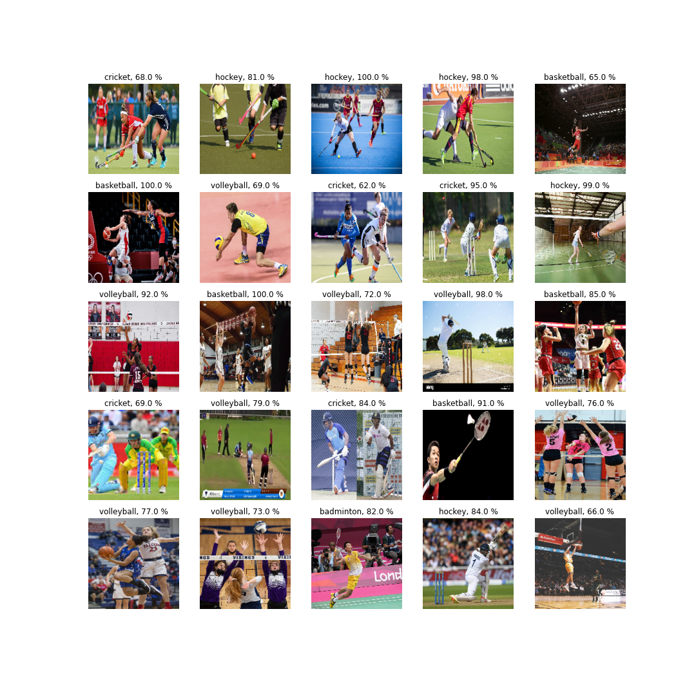

# PAI

## IoT and Computer Vision for Analyzing players on IISEB badminton court

This is based on Computer Vision for player detection and sports classification.

## Results

### Player Detection

### Sports Classification

# Contributions

Model I for object detection using YOLO v3  - Anushka Shelke

Model II for Sports classification using TensorFlow and Keras - Khadga Jyoth

Dataset and Labeling for both models - Yasmin Tadavi
